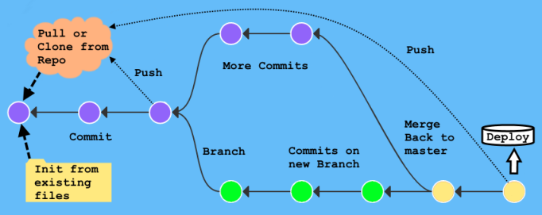
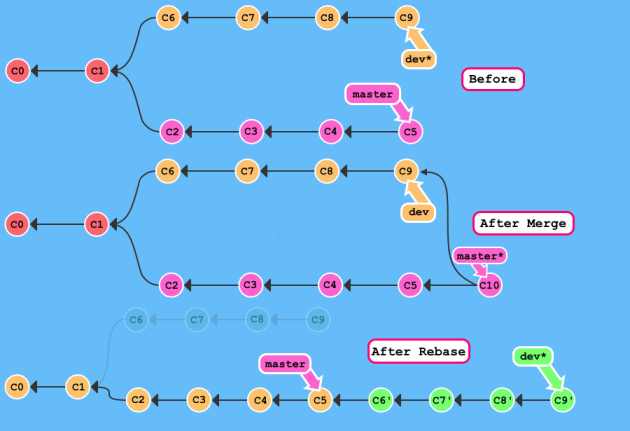

# GIT Commands for Single Devs / Small Teams
  
- [Why this document](#why-this-document)
- [Git Install](#git-install)
- [Sourcetree and Azure DevOps](#sourcetree-and-azure-devops)
- [Useful Links:](#useful-links)
  - [Setup](#setup)
  - [Learn](#learn)
  - [Reference](#reference)
  - [Other Stuff](#other-stuff)
- [Definitions](#definitions)
- [Git Illustrated](#git-illustrated)
- [Suggested Git Project Workflow](#suggested-git-project-workflow)
  - [Basic Git Process](#basic-git-process)
  - [Everyday Git Commands TYPICAL](#everyday-git-commands-typical)
- [Git Commands](#git-commands)
  - [The Basics](#the-basics)
  - [Initialization](#initialization)
  - [Push and Pull](#push-and-pull)
    - [Pull/Push TYPICAL](#pullpush-typical)
  - [Status](#status)
  - [Add Files](#add-files)
  - [Undo Tracked Files](#undo-tracked-files)
  - [Commit](#commit)
  - [Undo Commits](#undo-commits)
  - [Stashing](#stashing)
  - [Branches](#branches)
  - [Merge and Rebase](#merge-and-rebase)
  - [Merge vs Rebase Illustrated](#merge-vs-rebase-illustrated)
    - [Merge/Rebase TYPICAL](#mergerebase-typical)
  - [Troubleshooting](#troubleshooting)

## Why this document

This is a fairly complete list of Git commands that would be useful in the regular course of development for a Single Developer or a Small Team of devs, with a Windows focus.
Not all Git commands are listed, just the ones I find most useful, and ones likely to be used in the course of regular development. This document grew organically, sorry if it reads funny now - it's mainly meant as a Reference: it has a list a definitions and a standard workflow.

Why "yet-another-Git-Guide"? Because most of the ones I found online were:
- Geared towards Linux/UNIX/Mac developers
- Assuming you were working on a large team or a huge project
- Or that you want to contribute to Open Source projects with Pull Requests, etc
- Many of the Cheatsheets just listed the command, like `git add`, without context or options or explanation
- Some of the "beginner" guides assumed you had no CLI or dev experience

This guide is narrower in focus, for one or a few devs working together on a small to moderate sized project, likely not working on the same source file at the same time, and using Windows. And that you're somewhat experienced with developing software and Windows. It's long because it tries to explain things (so I don't forget...)
 
Suggestions, comments, fixes, etc are welcomed. I hope this is somewhat useful to someone!  
&emsp;--[Saul](https://github.com/sansbacher/)

**NOTE:** Normal Windows CMD/PowerShell CLI experience is assumed as all these Git commands are **CLI based**. You could use a GUI, such as [Sourcetree](https://www.sourcetreeapp.com/) or [GitKraken](https://www.gitkraken.com/), as the included GIT GUI is very basic if you're not comfortable with the CLI.  
Many editors have Git integration too, such as [VisualStudio Code](https://code.visualstudio.com/docs/editor/versioncontrol). In fact using a GUI is probably recommended for some things, such resolving complex same-file Merge Conflicts - it's just easier when you can see what's going on.

## Git Install
_It's assumed that **[Git](https://git-scm.com/downloads)** itself is installed:_  
When installing pick a reasonable editor (eg. [Notepad2](https://xhmikosr.github.io/notepad2-mod/), [Notepad++](https://notepad-plus-plus.org/), or [VS Code](https://code.visualstudio.com/), etc. - don't pick _Vim_ or _Emacs_ unless you already know those editors (and know to ignore advice against using them!); you can change the editor later if needed. Also select to use Git from the Windows Command line; OpenSSL + Checkout Windows-Style/Commit Unix-Style; MinTTY for MSYS2; and File System Caching + Git Credential Manager.
* If using MFA with GitHub or Azure DevOps also install the updated [Windows Credential Manager](https://github.com/Microsoft/Git-Credential-Manager-for-Windows) - it just works.  
* If you just want to use the regular Windows CMD or PowerShell command line (instead of the Bash shell) and don't already have some Win32 ports of the standard UNIX utils (like cat, cut, split, grep, etc) then add `%ProgramFiles%\Git\usr\bin` to your PATH.  
* If you use PowerShell and want a fancy prompt that shows current Git info/status and supports Git-command TAB completion you can install **Posh-Git** from the PowerShell Gallery with `Install-Module Posh-Git`

## Sourcetree and Azure DevOps
**HINT:** If using _Sourcetree_ and manually adding an [Azure DevOps Repo](https://azure.microsoft.com/en-ca/services/devops/repos/) via the Credential Manager, see:  
<https://docs.microsoft.com/en-us/azure/devops/organizations/accounts/use-personal-access-tokens-to-authenticate?view=azure-devops&tabs=preview-page>  
Basically, you create the Repo in Project that's in an Organization on: <https://dev.azure.com>, but the Personal Access Tokens are created per user, not per repo - from the _Person/Gear_ icon (top right).
- Create the Personal Access Token (PAT); for the Scope you need to include:
- Code (Read & Write)
- Packaging (Read)
  - Can also add Build (Read) and Work Items (Read) if desired

You can make the PAT last nearly a year. Copy the long PAT string, you'll need it in Sourcetree (just once, use a separate PAT for each app/system).
Then when adding to Sourcetree you need to select _Azure DevOps_, the Host URL needs to be:  
**https://_YourDevOpsOrgName_.visualstudio.com**  
 * In the future this may change to the new URL: https://dev.azure.com/YourDevOpsOrgName, but for now Sourcetree won't accept that.
  
The authentication will be via PAT, when you Refresh your PAT use your O365/AzureAD login as the username (eg. _username@domain.com_) and the long PAT string you created in Azure DevOps as the password (eg. _kjdhj48dfkdndkaldsbd8r4bdetcetcetc_). It should say "Authentication OK".  
When you look at all the Authentication settings in SourceTree you'll see various ones added, including dev.azure.com, but the Remote for any repos will be in *.visualstudio.com format (but work fine).

## Useful Links:

### Setup
- _Git_ Download: <https://git-scm.com/downloads>
- _Git Windows Credential Manager_, supporting MFA: <https://github.com/Microsoft/Git-Credential-Manager-for-Windows>
- _Sourcetree_, a decent Git GUI: <https://www.sourcetreeapp.com>
  - Or _GitKraken_ is another good Git GUI: <https://www.gitkraken.com>
  - Windows File Explorer / right-click fans may like _TortoiseGit_ GUI client: <https://tortoisegit.org>
- _VS Code_ has Git support builtin, if you don't have a favourite editor: <https://code.visualstudio.com>
  - Or for something small and quick try _Notepad2_: <https://xhmikosr.github.io/notepad2-mod>
  - But many people like the very similar _Notepad++_: <https://notepad-plus-plus.org>
    - Which can integrate with Git using: <https://github.com/alansbraga/NPPGit>
    - And TortoiseGit: <https://tortoisegit.org>
    - Or the Tortoise SVN plug-in seems to work with Git if you update the _tortoise_proc_path_ property to point to _C:\Program Files\TortoiseGit\bin\TortoiseGitProc.exe_ (or wherever it ends up on your system) in _nppplugin_tsvn.config_

### Learn
- If you're in a super rush, here's 6 quick commands to get up and running fast:
    <https://techcommunity.microsoft.com/t5/ITOps-Talk-Blog/Six-Git-Commands-Beginners-NEED-To-Know/ba-p/286891>
- A more comprehensive Git guide: <https://blog.udemy.com/git-tutorial-a-comprehensive-guide>
- A Git reference guide similar to this one: <https://dev.to/digitalocean/how-to-use-git-a-reference-guide-6b6>
- Visual "learn and type" Git tutorial: <https://learngitbranching.js.org>
- A quick guide to Git and GitHub for beginners: <https://product.hubspot.com/blog/git-and-github-tutorial-for-beginners>
- Learn Git in Y minutes walk-through: <https://learnxinyminutes.com/docs/git>
- One of many Git video courses using the GUI, if the CLI isn't your thing (Unity isn't really needed):
    <https://www.udemy.com/course/git-smart-learn-git-the-fun-way-with-unity-games>

### Reference
- A less wordy Cheatsheet than you're reading: <https://github.com/arslanbilal/git-cheat-sheet>
- A whole bunch of .gitignore files/templates: <https://github.com/github/gitignore>
- Remembering Mine and Theirs for Merge and Rebase: <https://nitaym.github.io/ourstheirs>

### Other Stuff
- If you make a mistake, this may help: <https://ohshitgit.com>
- If you do want to learn GitHub and Pull Requests: <https://www.brianbunke.com/blog/2017/05/12/github-pr>
  - Or this is another good site/overview of Forking and contributing: <https://www.gun.io/blog/how-to-github-fork-branch-and-pull-request>
- If you work on a larger project try this: <https://nvie.com/posts/a-successful-git-branching-model>
- Basic Markdown reference for GitHub README.md files: <https://guides.github.com/features/mastering-markdown>

## Definitions

What you need to know, more or less in the order you need to know it:

It's assumed you know that Git is a _Distributed Source Code Revision, or Version Control, System for keeping track of source files and collaborating with others_ - or why else would you be here? Probably you want to work on a project, saving to or sharing via [GitHub](https://www.github.com). Here's the vocab you'll need to know - starting at beginning and building up.

* **Index**  
    The Git Index, or The Index, is where Git keeps Track of files/folders, records all changes to files, and all the info, config, logs, etc it needs to work. It's in a .git/ folder in the root of a Working Directory (the local Repo).

* **Working Directory**  
    The local Repository (aka Repo) folder which has The Working Tree, where all the files are kept for a Project. The Working Directory/Tree is either Dirty or Clean depending on if any of the files Git tracks in its Index have changed. Has the hidden .git/ folder which contains Git's Index. You can start with an empty Working Directory, or a folder that already has source files, or Clone from another repo (eg. copy a Remote repo, such as from GitHub, to your machine).

* **Tracked and Untracked Files** 
    Tracked Files are files within the Working Directory that Git is monitoring for changes, they are Tracked within the Index. If they are Modified/Deleted then Git will be aware of it and you can Stage them to be included in the next Commit. Likewise an Untracked file is one that isn't tracked in the Index and is basically ignored by Git (it won't be protected by Git). Folders are not Tracked, they exist in Git by virtue of a file being Tracked inside that Folder.

* **Staged File**  
    If a Tracked file is Modified it can be Staged with a snapshot of the file so the next time a Commit is made it will be included in the Index [in actuality just the difference between the last snapshot of the File and the Staged File needs to be Committed, keeping the Index small]. If the File is changed again after being Staged it will show up as Modified and need to be re-Staged to be included in the Commit as only Staged files are included in Commits, and Tracked files are not automatically Staged.

* **Ignored File**  
    In general any file that isn't Tracked is ignored by Git (eg. if you were to Reset or Revert a Working Tree/Repo to a certain state all Tracked files would be updated/deleted/changed to reflect the chosen state, but Ignored Files will be left as-is). But Git will notify of these Untracked Files - to silently Ignore files (such as .EXE files or anything that could be derived from the source files, or .TMP files, etc) you can create a .gitignore file in the root of a Working Directory which lists which files/folders to ignore.

* **Commit**  
    A Commit is a point-in-time snapshot of all Staged Files (which are Tracked Files) as they were when Staged [if they are Modified after being Staged, but before being Committed the snapshot is not updated]. The Index stores the difference of files between the current Staged snapshot and the previous Commit. The Commit gets a unique Hash Number that represents the Commit in the Index, which means it can't be changed without changing the Hash [if a Commit is amended/edited then in reality it is deleted and re-Committed and a new Hash is generated]. You can reference a Commit by the Hash, or enough of it to be unique (usually the first 7 characters), or a Tag can be assigned to a Commit. Commits also have a comment that explains what's in a Commit. You can make Commits when you change, delete, or add code to files to capture those changes - even if you don't end up keeping the code in the final product (so they won't be lost forever).

* **HEAD**  
    The currently pointed to Commit in the Index is called HEAD, as it is usually the tip of the current Branch. When the next Commit is made the HEAD pointer is updated to the latest Commit. But you can Checkout a specific Commit (which isn't the tip of a Branch) resulting in a Detached HEAD situation, allowing you to review the Working Tree at a certain point in time. The Commit before HEAD would be its parent, the Commit before that is the grandparent, back to the initial Commit.

* **Branch**  
    A series of Commits back to a common ancestor is a Branch. The first/initial Branch is usually called "master" and begins at the initial Commit. At any point another Branch can be given a name and diverge off with a new line of Commits, such as "dev", "bugFix", "someFeature", etc. Branches can be Merged back together (eg. when a feature or bug has been fixed). Usually the master Branch is where you deploy live/production code from, and a separate Branch is created for other development paths. A Branch can be Checkedout and worked on without impacting other Branches.

* **Checkout**  
    Checkingout a Branch (which implies Checkingout the tip/end-point Commit of a Branch), or a specific Commit (by Hash, Tag, or anything else that Git can resolve to a Commit in the Index) means the state of the Tracked files in the Working Directory are set to how they were snapshotted when they were Staged for that Commit. Ignored files are left alone, but all Tracked files will be as they were in the Commit - in this way you can view any Committed snapshot in time, on any Branch held in the Git Index. If you subsequently Modify any Tracked files (or add a new file to be Tracked) they can be Staged and then a new Commit will be added to the Checkedout Branch, or a new Branch created.

* **Stash**  
    Temporary storage of Tracked files, like an "unnamed temp" Branch. If you have Modified files but you don't want to Commit and you don't want to lose those changes, but you need to Checkout a different Branch/Commit into your Working Directory (eg. to start working on a bug fix ASAP, or see how the code was at a certain point in time - like before a some major change or code refactor) you can Stash your Modified files first. You can then Apply your Stashed files to your current Working Directory, or Check back out the Branch you were working on then Apply your Stashed files and pick up where you left off. Stashed files are only in your local Repo, they are not pushed to any Remote Repos [use an actual, if temporary, Branch for that].

* **Remote**  
    As in a Remote Repo, a Git Repository that is stored on some other non-local machine. It could be someone else's computer (you can clone from and Push/Pull from someone else's local repo), a private Git server, or a hosted Git service like GitHub. In a local Git Repo the default name for the Remote repo is "origin" (since generally you keep your source code on a server somewhere to protect it and Clone it to your local computer) - thus the Remote Repo would be the origin of those files. There are several services beyond GitHub that are Git compatible, such as GitLab, BitBucket, etc - some also offer free Public Repos (though some charge to host Private Repos). GitHub is the most popular. Microsoft has an Azure Hosted version, part of Azure DevOps, called Azure DevOps Repos. GitHub and Azure Repos treat README.md files as special, showing their Markdown contents as HTML when you browse Repo directories, and also support LFS [Large File Support] as otherwise GitHub has a 100MB file size limit. Markdown is a simplified version of human readable Text Files that map to basic HTML. This document is written in Markdown.

* **Pull or Push**  
    The act of Pulling down updated files from the Remote Repo to your local Report (Working Directory) - to refresh your working copy is a Pull (the initial Pull is called a Clone, since you're starting with nothing). The act of Pushing changed files up to the Remote Repo is a Push. You can Push/Pull any (or all) Branches, but generally only the "master" and perhaps a "dev" Branch. The Pushed/Pulled files are then Merged into the local (or Remote, depending on if it's a Push or a Pull) Repo. Local versions of the Remote's Branches are designated with the name of the Remote/Branch, such as origin/master - indicates the master Branch on the Remote called origin, which would map to your local master Branch (and upstream/dev would be the dev Branch on the Remote called upstream).

* **Merge**  
    When Pushing or Pulling changes to/from a Remote Repo those changes need to be Merged together by creating a new set of Files comprising all of the files, and changes to Files, from both Branches. If there are Merge Conflicts you will be given a chance to pick either which file "wins" or even which Hunk of a file "wins" (a Hunk is Git's name for a chunk or part of a file that has changed). Even if a file is changed by both Branches as long as it's not in the same Hunk/part then the file will be automatically Merged - only when both Branches change the same line(s) will a Conflict occur. You can also Merge two local Branches, such as merging a bugFix Branch into a dev Branch, or the dev into master Branch before deploying. In addition to Merging you can also Rebase - which replays/moves a Branch onto another Branch - the end result is more or less the same.

* **Pull Request**  
    When dealing with someone else's Repo (which would be a Remote Repo from your perspective) to which you don't have permission to Push and Merge in changes yourself you need to submit a Pull Request - which means you're requesting the Repo's maintainer to Pull in your changes. Open Source projects on GitHub [or a larger Project for a larger Team] would have code maintainers who do code reviews of the suggested Pull Request to determine if they will accept it and Pull and Merge it into the code base. Generally if you found a Public GitHub Repo you wanted to contribute to [most have a CONTRIBUTING.md file that explains the rules] you would first Fork it [which makes a copy to your GitHub account], then Clone it to your local Repo, make changes, Push to your GitHub (origin), and then submit a Pull Request (to what is then commonly called the "upstream" Remote) to have the maintainer review and accept your changes.

## Git Illustrated
This image was created from <https://learngitbranching.js.org/> and shows an example of several Git objects/processes
  
The Circles are Commits, the first one was created by **init** from local files, or **clone** from a remote repo like GitHub (or possibly **pulled** if it wasn't the first). After the 3rd Commit there was a Branch (the green Commits), but additional Commits continued (the purple Commits). Later the two Branches were **merged** together (yellow Commits) - and the final code was **deployed**, at various stages it was also **pushed** back to the Remote. The solid black arrows between Commits point back to a Commit's parent (all the way back to the initial Commit), thus the Commit after the Merge has two parents. Another picture under [Merge vs Rebase Illustrated](#merge-vs-rebase-illustrated).

## Suggested Git Project Workflow

**For a small Team or a Single Developer:**
1. For a Project create and Clone a repo with a master Branch [to deploy from] and a single dev Branch [for development / work-in-progress / beta].
2. Then each developer creates a feature/bugFix/etc Branch (or name-dev Branch, eg. jane-dev) for whatever they are working on.
3. Initially they would all point to the same initial Commit (empty repo or the existing code), and diverge from there.
   1. The master Branch should always be deploy-ready, the dev Branch would be based on the master Branch after each release.
   2. The dev Branch should be the "base" from which all feature/bugFix/name-dev Branches are based on.
4. Everyone Checksout on their feature/bugFix/name-dev Branch doing what they need to do, testing their work as they go. (they are free to make sub Branches as needed)
5. When someone finishes something they Merge their Branch into the dev Branch, testing with any other new changes anyone else has Merged in.  
    Rebasing dev onto their Branch may help eliminate conflicts in their Branch before finally Merging their Branch into dev.
6. When everyone (or enough people) have finished merging in their work to dev Branch, do final tests in dev, then Merge dev into master Branch and deploy.
7. Then start again (ensure all Branches point to master [`branch -f` to force], and begin diverging and working, then merging back in)  
    This would be working on a new release. But you can always checkout the previous release to do bugfixes.
8. Everyone is responsible for pushing their Branches to Remote and pushing dev to Remote, if they've merged in and tested some feature/bugFix.  
    Push master to Remote only once released, and Tag it with something like "ver1.0" or something.

**For a single developer only:**
* If you didn't want to keep features/bugFixes in separate Branches you could just work in dev.
* Then once tested Merge into master, and deploy.
* But having separate master (release ready), dev (work-in-progress), and separate feature/bugFix Branches is good practice.  
    It allows you to jump between features/bugFixes if needed, and make big changes/mistakes while maintaining a release-ready master Branch.

This all assumes no one is really working on the exact same "thing" - likely different files or modules, and if some common library is edited (eg. fixed) let the team know to Pull changes from dev to get the now updated common file. Everyone is equal, and competent within their realm, on the Team.  
If people don't play nicely then you need to look at having certain people "own" certain Branches and Devs would need to submit Pull Requests which would be reviewed and then Merged in. (There's lots of guides on the internet for using Git with larger Teams/Projects, including one linked above)

### Basic Git Process

Generally this is what you'll be doing, see next section for the commands:
1. Create a repo (repository) for your Project in GitHub
2. Clone (copy) the repo to your local machine using Git
3. Add/Update files in your local repo and Commit (save) the changes
   1. Use separate Branches for in-development work, bug-fixing, new-features, etc
4. Push your changes to the Project in GitHub
5. Other devs do the same with their local repos
6. Pull the changes others have made to your local repo
7. Merge everyone's changes together
8. Push the final version (master Branch) to GitHub
9. Deploy from the master Branch
10. Roll-back or undo if ever needed, as Git saves all changes

### Everyday Git Commands TYPICAL

These are the commands for basic day-to-day Git usage, this is what you need to get started.  
NOTE: some commands only need to be run once, such as `--set-upstream` when you `git push` the first time... but Git will prompt you when needed, just read any messages, they're not listed here. For full details of these commands see the next section.

Either start with some existing files to initialize a local repo:  
`git init`  
`git remote add origin URL`  
_OR_, create a new remote repo in GitHub and clone it locally:  
`git clone URL`  

Then _create a .gitignore_ and _Create/Edit some code files_. After some work check what's not Commited, then Stage and Commit those files:  
`git status`  
`git add -A`  
`git commit -m "Added some new files to master"`  

Push those files to the remote repo, but first pull in any changes someone else may have pushed to the remote repo:  
`git pull --rebase`  
`git push`  
(_Possibly_ deal with any conflicts)

When you're ready to work on some new feature or a bug fix create a new Branch:  
`git checkout -b dev`  
_Edit some more files_ and if you've not added any new files you can Stage and Commit all at once:  
`git commit -am "Edited some existing files"`  
_Repeat as needed_, using `git add -A` for any new files.

Once your dev or bugfix work is done, Checkout master and merge in your work from dev:  
`git checkout master`  
`git merge dev`  
`git log --oneline`  
_Possibly_ deal with any merge conflicts, but if everything looks good push your code to the remote repo:  
`git pull --rebase && git push`  
_And Deploy_ your code or application.

You can now either delete the unneeded dev Branch:  
`git branch -d dev`  
_OR_, if you want to keep the dev Branch but "catch-it-up" to the now merged-together master Branch:  
`git branch -f dev`  
Then Check it out to continue working (editing, Staging, Committing, and merging back to master):  
`git checkout dev`  
Remember: before starting to work on something new, you want your dev Branch to point to the current master, and you should `git pull` to ensure your local master includes any work someone else may have committed at the same time.

## Git Commands

These mostly all need to be run in a Repo (local Working Directory) or a child directory under a Repo. Commands are more or less in the order you need them. You won't need all these commands all the time, but they're handy to know. For the typical everyday Git commands, see the previous section.

### The Basics

**Get help** (add `-a` to see all commands)  
Adding a command after help such as `git help commit` or `git commit --help` will bring up an HTML page specific to that command. Git also has helpful error messages, so read those.   
`git help`

**View Git options** in your current working directory (can add `--global` to see Global options)  
`git config --list`  
To view a specific option, such as `core.editor`:  
`git config --get --global core.editor`

**Change a specific option**, such as `core.editor` to _Notepad2.exe_, wherever it is installed, either path separator is fine:  
`git config --global core.editor "'c:/Tools/Utils/Notepad2.exe' -s Configuration"`  
Handy since upgrading Git will likely overwrite your Editor value, probably to VS Code, where ever it is installed:  
`git config --global core.editor "'C:\Users\%USERNAME%\AppData\Local\Programs\Microsoft VS Code\Code.exe' --wait"`  
For Notepad++ try:  
`git config --global core.editor "'C:/Program Files (x86)/Notepad++/notepad++.exe' -multiInst -notabbar -nosession -noPlugin"`  
Or just specify something that is in the PATH and it'll work too:  
`git config --global core.editor "Notepad.exe"`  
Your `user.name` and `user.email` which is used for Commits:  
`git config --global user.name "Jane McDeveloper"`  
`git config --global user.email "jane@mcdev.com"`  
Tip: You can omit the `--global` and override Global settings per-repo if needed.  

**Edit Global options visually**, opens in current `core.editor`, see above to specify another editor  
(The `--global` file is usually located in: `%USERPROFILE%\Home\.gitconfig` if you needed to recover from a mistake. Or if you upgrade Git you can backup your Global Config before, as it overwrites the Editor)  
`git config --edit --global`

**Set current repo options**, using the editor  
Can set most of the same `--global` options in the local file, to override global options.  
(The current repo options are in the hidden `.git/` folder in the root of the Working Directory, in a file called `config`)  
`git config --edit`

### Initialization

**Create a new/empty local repo** in the current directory, which means Git adds a hidden `.git/` folder to hold the Index.  
You should then add some files, esp. a `.gitignore` text file to list any files to ignore, see structure here: <https://guide.freecodecamp.org/git/gitignore>  
And many preconfigured .gitignore files can be found here: <https://github.com/github/gitignore>  
`git init`

**Add a Remote repo to an existing local repo**. Can have more than one Remote.  
Usually remote-Name (aka the Remote) is `origin`, but could be anything. URL is like: https://github.com/userName/repoName.git  
Azure DevOps Repo URLs look like: https://orgName@dev.azure.com/orgName/repoName/_git/repoName  
Credentials may be prompted, eg. if it's an Azure DevOps repo, it may pop-up and auto-create a Personal Access Token  
`git remote add origin URL`

**List what Remotes have been added to a local repo**  
`git remote -v`  
Rename a Remote in a local repo  
`git remote rename current-Name new-Name`  
Delete a Remote from a local repo (but leave it on the server)  
`git remote rm remote-Name`

**Clone\download a remote repo** Will create a folder called "repoName" in current directory. URL should be like https://domain.com/path/repoName.git  
Will call the Remote `origin` (use `-o otherName` to use a different name), and will have `origin/master` as default Branch.
If you Checkout origin/master it will go into detected HEAD mode and use origin/HEAD since origin/master only updates from Remote - you must Fetch to update origin.  
Can also specify a `folderName` after URL, which doesn't have to exist, if you want a different folder name.  
Add `--depth 1` to only clone latest Commit (shallow clone) if you don't need the full Commit history.
Credentials may be prompted, eg. if it's an Azure DevOps repo, it may pop-up and auto-create a Personal Access Token  
`git clone URL`

### Push and Pull

**Fetch updates from a repo's Remote (origin)**, downloading any missing Commits and update where remote Branches point (eg. origin/master).
Does not update anything about the local repo's state, won't update your Branches. It downloads data but doesn't change state, use `git merge` [or `rebase`] to do that.
Fetch also supports the remote-Name and colon refspecs, as listed under `git push` below, but source:dest reference source = Remote, dest = local.  
`git fetch`

**Pull** will do a `git fetch` and a `git merge FETCH_HEAD` (which is the recently fetched remote Branch, eg. origin/master - which matches local master).
Can add a merge/rebase Conflict strategy with `-X`, eg: `-X ours` or `-X theirs` to resolve Hunks favouring ours [mine] or their code - _REVERSED FOR REBASE_!  
`git pull`  
Or to Fetch and `rebase` instead of `merge` use `--rebase` which is often more common, esp. with public/shared repos:  
`git pull --rebase`  
If it's the first Pull may need to specify the local Branch as the remote tracking info won't be set yet, but git will remind you. The remote-Name and source:destination colon refspec for fetch/push work for pull as well.  
`git pull --rebase origin master`

**Push changes back to the Remote repo** to publish them. Will also update the local repo's state for the Remote repo, as if a Pull had been done.
Push also matches local some-Branch to origin/some-Branch, to update and reflect changes.
Only pushes the current Branch you are on, to push ALL Branches add `--all` which will create origin/other-Branch, etc.
If more than one Remote can specify remote-Name after push, you can also specify a Branch, eg: `git push origin master` - even if not checked out.
Can also specify a source:destination, as in `git push origin local-Branch:remote-Branch` using colon refspec, remote-Branch will even be created if needed.  
NOTE: If Push is rejected because Remote was updated, either fetch or pull to integrate the Remote changes before pushing local changes.  
`git push`  
If it's the first push the branch tracking won't be set, so use `--set-upstream`: (or if pushing a dev or other Branch, which you can specify. Git tells you this if you haven't run it and it only happens once so no need to memorize this)  
`git push --set-upstream origin master`

#### Pull/Push TYPICAL
The general/common sequence of commands (except the first pull/push of a repo).
Update your local repo from Remote and then Push your changes up to the Remote repo. Safe to do with no changes.  
`git pull --rebase`  
`git push`  
In CMD/bash as one line:  
`git pull --rebase && git push`  
In PowerShell as one line:  
`git pull --rebase ; if($?) { git push }`

### Status

**List current status**, including New Tracked (staged to be committed) files / Changes to already Staged files / Untracked (not staged) files.
This is a very common command, as it shows current state of the Git Index, so those bash or Posh-Git prompt extensions basically show this info. Any files/folders in .gitignore will not be displayed as Tracked / UnTracked / Modified.
Add `-s` to see a short summary. Or `-sb` for Short + Branch info. But add `--ignored` to show any files being .gitignore'd.  
`git status`

**List which files are Tracked** in the Git Index, regardless of if they are modified or committed:  
`git ls-files`

**Show the Log of all Commits**, hashes, dates, authors, and Branches, add a `fileName.txt` to see only Commits related to that file.
See an ASCII Branch/Merge Tree with `--graph` (but a GUI tool like Sourcetree is just easier).  
`git log`  
To see a brief summary of just the last 10 commits:  
`git log --oneline -n 10`  
To get an overview:  
`git log --stat --summary`  
You can combine these, this can be handy instead of pulling up a GUI tool:  
`git log --oneline --graph --all`

**Show a file from a particular Commit** which shows the lines added/changed/removed, is case-sensitive for file name, and needs a Commit Hash (or first 7 characters) or Branch name:  
`git show CommitHash:fileName.txt`

### Add Files

**Stage\Track (add) ALL files** to be Committed.  
Once a file is Tracked then modifications to it are updated when commits are made if it's staged, you don't need to add it again _but_ you do need to Stage it using `--update`, or use `git commit -a` when Committing.
Otherwise you will need to re-stage modified files using this command each time.
There is also `git rm` and `git mv` to remove or move files within the working tree. If you do it with file system commands they will be Untracked, so re-add them.
Since only Files are Tracked, to force Git to Track an empty folder, place a `.gitignore` or `.gitkeep` file inside that folder and Track that file.  
`git add .`  
Or: (also `-A` works)  
`git add --all`

**Stage\Track just 1 File** or some files to be Committed  
`git add some-File.txt another-file.txt`  
`git add *.txt`

**Restage/update any already Staged/tracked files**, but not any brand new files (also `-u` works)  
`git add --update`  

**Interactively Stage/Unstage files** via a simple menu (or `-i`). Use the highlighted (l)etter or #:, such as for 'add tracked', pick files by number, press [Enter] at >> prompt, then 'quit'.  
`git add --interactive`

### Undo Tracked Files

**Untrack (unstage/remove) a file** so it won't be Committed (or files, like *.txt).
HEAD is a pointer -> to the most recent Commit, normally the tip of the active/checked out Branch itself, but can be checked out itself (resulting in Detached HEAD mode).
`git reset` by itself will unstage _all_ Tracked files, leaving them as untracked.  
`git reset HEAD some-File.txt`

**Undo status back to how HEAD was before you added any files** - REMOVES any Tracked files (but leaves un-tracked files). Don't use on public Branches that someone else may be using (eg. origin/master), use revert instead!  
`git reset --hard`

**Undo changes** (or undelete) just one Tracked file to how it was in the last Commit.
Almost all committed information in Git can be recovered; however any uncommitted information can be lost forever.
If deleted may need to Unstage/untract the file first if it was Staged: `git reset HEAD some-File.txt`  
`git checkout some-file.txt`  
Or sometimes, if names of files and Branches conflict:  
`git checkout -- path/to/file.txt`

**Cherry-pick a single file/files** to get just a few files from a previous Commit specify a CommitHash/Branch/Tag/etc between checkout and -- to specify where to revert that file to, eg. :  
`git checkout CommitHash -- path/to/file.txt some-OtherFile.txt`

### Commit

**Make a Commit** to the current Branch of all Staged files to the Git Index.
If you skip `-m "message"` the editor will open so you can type a longer message. If you haven't created/checked out a Branch it will create one called master.  
Good Commit messages will be a short 1 line sentence [up to 50 chars] summarizing your changes, a blank line, then a short paragraph with more details.
Use the imperative: "Add tests for X" not "I added test for X" since a Commit message tells what will happen once a Commit is applied to the Working Tree.  
If you can't describe in few sentences what you did, you probably should commit more often.  
`git commit -m "some commit message"`

**Automatically Stage and Commit** any Tracked files of any changes/deletes, but not NEW-unTracked/Files, like doing a `git add -u` ( or `--all`).
Very common command, can just use `-am`.
Eg. if you have already Staged/Tracked 4 files, and Committed, then make additional changes, you can just `git commit -am`, no need to `git add` again.  
`git commit -a -m "some commit message"`

**Rename the previous Commit message**, opens an editor.  
`git commit --amend`

**Amend/Update the previous commit** if you missed a tiny change (typo or something). This just re-does the previous commit, including all modified files (with `-a`)
Don't do this to Commits that have been pushed/shared to a Public repo.  
`git commit --amend -a --no-edit`

**Add a Tag to some Commit** (or if omitted to HEAD) to name a Commit if it's significant (eg. a new release, like 'v1.0' or 'v1.2').
Tags can be checked out (since they reference a Commit), but HEAD is then Detached since you can't Commit to a tag.
By default Tags are not pushed to Remotes, add `--tags` to the `git push` command if wanting to push Tags (eg. milestone releases on master Branch), they will be Pulled automatically if they exist.  
`git tag "aTagName" [SomeOptionalCommit]`

**See Tags**, can specify a pattern after to find only certain tags. Or `-d` to delete a tag:  
`git tag -l [Pattern]`

### Undo Commits

**Undo the previous Commit** - Local Branch  
HEAD~1 refers to 1 Commit _before_ the current HEAD, ie. the parent of HEAD, could go back ~## times.
Only works on the local Branches in your repo, not remote Branches in remote repos, use `revert` for that.  
`git reset HEAD~1`

**Reverse the previous Commit** - Remote Branch, actually creates a new Commit that reverses all changes in the current Commit. Opens up the editor.  
`git revert HEAD`

**Roll back master Branch**, if you accidentally Commit to master Branch something that should be in new-Branch (eg. started fixing a bug in master).
This creates new-Branch pointing to current HEAD in master, resets master to previous Commit, and then switches to new-Branch which still points to the original Commit with your modified code.  
`git branch new-Branch`  
`git reset HEAD~ --hard`  
`git checkout new-Branch`

### Stashing

**Save/Stash unCommitted changes** (in a 'dirty' working directory) somewhere (ie. temporary Work In Progress) and revert to HEAD Commit (to clean state).
So you can go back to how things were but keep the changes you made, without making a new Branch. Handy if you want to `git pull` to update, then `git stash pop` to re-apply.  
`git stash`

**See your Stashes**  
`git statsh list`  
Or the actual files  
`git stash show`

**Remove a Stash** (can add a Stash number after, seen as `{##}` in the stash list)  
`git stash drop`

**Apply a Stash** to the current checked out Branch (doesn't have to be the same Branch as it was Stashed from), can also specify a Stash `{##}`.
Can use `apply` instead of `pop` to leave the files in the Stash, so you can apply them again.  
`git stash pop`

### Branches

**List all Branches** FYI: current/checked out Branch has a `*` before it. To show Remote repos/branches too add: `-a`, to see last Commit in each add: `-v`
To show only branches not yet merged into the checkedout Branch add: `--no-merged`, there's also `--merged` to see which have been merged in.  
`git branch`  
See more details, including the current Commit message each Branch points to and some previous Commits:  
`git show-branch`

**Create a new Branch** pointing to HEAD (the current Commit point in the current checked out Branch):  
`git branch some-branch`

**Checkout/Switch to a Branch** FYI: HEAD will then point here, to whatever is checked out. Your Working Directory will now update to some-Branch (Tracked files).
Can also checkout a specific Commit by hash or Tag, which detaches HEAD from pointing to a Branch, but you can only Commit to a Branch.
Can also specify relative Commits to a Branch, append `^` for each parent. So grandparent would be _some-Branch^^_
Or append `~##` to move back some number of Commits, so grandparent would _some-Branch~2_  
FYI: in CMD/DOS `^` is for escaping, so `^^` is really `^`, the grandparent would be `^^^^`, etc. It's normal ^ = parent in PowerShell or Bash.  
`git checkout some-Branch`

**Create a new Branch AND checkout** that Branch at the same time.
Could rename with: `git branch -m some-Branch new-Branch-Name` and delete later if you just need a temporary Branch     
`git checkout -b some-Branch`

**Delete a Local Branch** Or use `-d`. Use `--force` if the Branch hasn't been merged in:  
`git branch --delete some-BranchToDelete`  
Delete a Remote Branch by pushing nothing to it:  
`git push origin :remote-BranchToDelete`

**Move (re-assign) some-Branch to a specific Commit** with `-f` for Force. HEAD~## references ## Commits back (but could be any Commit by hash or Branch^^^, etc.)
Or another Branch, eg. to align two Branches.
If the final Commit is omitted then HEAD (the current checked out Commit) is assumed.  
`git branch -f some-Branch [OptionalCommit or HEAD~##]`

### Merge and Rebase

**Merge** (combine/ties together) some-Branch _INTO_ the current/checked out Branch (non-destructive). Joins divergent Branches together with a new Commit.
Can add a merge Conflict strategy with `-X`, eg: `-X ours` or `-X theirs` to resolve Hunks favouring ours [mine] or their code. See: <https://nitaym.github.io/ourstheirs>  
Maintains history, whereas `rebase` rewrites history. Could specify multiple Branches to merge if they are not complex merges, aka octopus merge.
A fast-forward merge will happen if HEAD is an ancestor of some-branch and hasn't diverged, to keep the history use `--no-ff` to create new Commit anyway.
Merge is a common command, usually you checkout master, then merge some-Branch:  
`git merge some-Branch`

**Rebase** (replay/move) the current/checked out Branch _ONTO_ destination-Branch (similar to `merge`, but current-Branch moves to the tip of destination-Branch).
Can add a rebase Conflict strategy with `-X`, eg: `-X ours` or `-X theirs` to resolve Hunks favouring ours [mine] or their code - _REVERSED FOR REBASE_:  
Reversed because you Rebase from current branch [HEAD] onto destination branch. But with Merge you merge some-Branch into current Branch, ie HEAD. See: <https://nitaym.github.io/ourstheirs>  
"The golden rule of git rebase is to never use it on public branches" -> before _git rebase some-Branch_, always ask "Is anyone else looking at some-Branch?"  
However, rebasing your own local Branches back onto the local master is preferred, over merging local Branches, when working with remote repos.
This is because rebase is used in a workflow that treats the history at the remote as the shared canonical one, and treats the work done on the branch you are rebasing as the third-party work to be integrated, and you are temporarily assuming the role of the keeper of the canonical history.  
Rebase is a common command, usually you Checkout some-Feature, then  
`git rebase master`  
General form of the command is:  
`git rebase destination-Branch`  
Can also do be specific about destination and source (this moves source-Branch onto the tip of destination-Branch. Eg: `git rebase master featureBranch` - helps avoid accidentally rebasing master onto featureBranch - recommended):  
`git rebase destination-Branch source-Branch`

### Merge vs Rebase Illustrated
This image shows the difference between Merge and Rebase, created using <https://learngitbranching.js>  
  
The image shows the Working Tree (at the **top**) _before_ Merge or Rebase. The (C#) circles represent Commits (in order they were made) and the black arrows show the parent of each Commit (C5's parent is C4, which has C3 as its parent, etc). The coloured blobs/arrows indicate Branches (master and dev). Thus at Commit C1 the dev Branch diverged from master, but master continued to have Commits made to it, while dev was simultaneously worked on. They now need to be re-joined:
 - The **middle** picture shows what it would look like after _Merging_ dev INTO master with `git merge dev` (with master Checkedout). Note that a new Commit is created with 2 parents (C5 in master and C9 in dev) that has the union of both Branches.
 - The **bottom** picture shows what it would look like after _Rebasing_ dev ONTO master with `git rebase master dev`. Note that the Commits from dev are replayed onto master from the point dev diverged from master [they're new Commits - denoted C6', C7' etc] and the original Commits are discarded. Commit C9' (the final replayed dev Commit) has all the code as if work on dev Branch had commenced after all the work on master was done (same as being merged).  
    Tip: the master Branch can be moved to where dev is (C9') with `git branch master -f` since dev is already Checkedout.

**Merge/Rebase Conflicts**: If there's a conflict with a certain file/files it's helpful to use a GUI tool that can show the Differing Lines (difftool).
But Git will handle different parts of the same file that are changed that don't conflict, and for when the same lines _are_ changed it will indicate IN the file.  
In the conflicted file: After "_<<<<<<< HEAD_" will list your lines, then "_=======_", then their lines until "_>>>>>>> CommitName_" for each Hunk -- But REVERSED for Rebase! (see above).  
If you know there will be Conflicts, you can use `-X ours` or `-X theirs` to specify which side ours/mine or their/the-other to keep. REVERSED FOR REBASE! (see above).
These conflicts happen while merging or rebasing two Branches, or while pulling in from remote. BUT: Suggest using a GUI tool to keep it all clear!
To See the failed patch:  
`git am --show-current-patch`  
Resolve all conflicts manually, either by editing the file to be 'correct'. Or to grab a whole file from one side or the other:  
[In a merge `--ours` refers to the checkedout-Branch, in a rebase `--ours` refers to the being-rebased-in-Branch, ie. the destination-Branch]  
`git checkout --ours someFile.txt`  
OR: [In a merge `--theirs` refers to the being merged-in-Branch, in a rebase `--theirs` refers to the checked-out-Branch, ie. the source-Branch]  
`git checkout --theirs someFile.txt`  
Then mark them as resolved with: (or `git rm file.txt` to remove the file, etc)  
`git add conflicted-Files.txt`  
Continue with: (or `merge --continue` as the case may be)  
`git rebase --continue`  
OR Abort/Back out with  (or `merge --abort`)  
`git rebase --abort`

**Selectively apply (replay/copy) 1 or more Commits** to the current HEAD (_Cherry Picking_), similar to rebasing but more selective as to which Commits are replayed.
You can refer to Commits by Hash, or any other method, including Branch [references the Commit currently pointed to by Branch], Branch~##, Branch^, etc.
To cherry pick a _single file_ or files use: `git checkout CommitHashOrBranch -- some/file.txt` (see above under `git checkout`)  
`git cherry-pick CommitHash1 some-Branch another-Branch^^ [more Commits, etc etc]`

#### Merge/Rebase TYPICAL
The general/common sequence of commands when adding a new feature or fixing a bug, etc: Generally start a new Branch, make Commits, then merge (or rebase) with master.
This way master remains deploy-ready, and other people can work on other features/bugs.
If a larger project then have a dev branch in parallel with master, merge new features/bugs against dev, then finally dev with master when all ready:  
`git checkout -b newFeature`  
_Do you work editing files_, then:  
`git add -A`  
`git commit -am "Completed working on new feature"`  
Switch back to master and merge in newFeature:  
`git checkout master`  
`git merge newFeature`  
(_Or_ rebase newFeature onto master: `git rebase master newFeature` )  
_Perform final tests and confirm all is well_, then check:  
`git log --oneline -n 10`  
And remove newFeature Branch:  
`git branch -d newFeature`  
Can then Push or deploy, etc from the now up-to-date master Branch.  
NOTE: If you think others may have updated master with _their_ changes after you made your newFeature Branch then you could `git rebase newFeature master` first, so that any changes others have made to master will be pulled in your newFeature Branch first (allowing you to resolve any conflicts) _and then_ Merge newFeature into master [if there are no conflicts then the Merge will already be up-to-date but the record of all Commits will be retained].

### Troubleshooting

**Compare the current state / Commits to other Commits, or files**. Though using a GUI like Sourcetree is probably easier here.
You can use most of the HEAD^^, someBranch~## etc type references too, or Tags or Commit Hashes.
Add: `--name-status` to only show Name/Status not contents.
You can also see just the Statistics of the differences of files with: `--stat` (can use `--stat *.txt` to see just certain files)  
Show changes in the working tree not yet staged for the next Commit:  
`git diff`  
Show changes in working tree not yet staged against some-Branch:  
`git diff some-Branch`  
Changes between last Commit and what would be Committed next (if you were to `git commit` _without_ `-a`):  
`git diff --cached`  
Changes between last Commit and what would be Committed next if you did run `git commit -a`:  
`git diff HEAD`  
Changes between last Commit and what would be Committed next but only for someFile.txt:  
`git diff HEAD -- .\someFile.txt`  
Compare the version before the last commit and the last commit:  
`git diff HEAD^ HEAD`  
Compare changes between tips of 2 different Branches:  
`git diff some-Branch master`  
Show differences that a Branch has (can use HEAD^ etc notation too):  
`git show some-Branch`

**Search** through Commits, Branches, or the whole Git Index for files matching "_search string_".
Omit some-Branch to search all, or specify a specific Commit. Add `-i` for ignore case before "search string":  
`git grep "search string" some-Branch`  
Or just in certain files:  
`git grep "search string" *.js`  
Note: The `--` is often used to indicate a file is next, in case the filename is the same as a Branch, so: `git grep "search" -- dev` would search in a file dev, not Branch dev.  

**See list Git History** Roughly ~90 days of the last `git` commands you've entered in the repo, most recent first, showing how you got where you are now. Helps to reverse things if needed.
Eg. if you knew things were okay 7 Commits/Actions ago, based on the Commit messages you could then do: `git reset --hard HEAD@{7}` to reset your repo to that point:  
`git reflog`  
This checks the Git Index, showing dangling objects (add `--unreachable` for some more Objects).
Can use `--lost-found` to have them restored with Hash names to the `.git/lost-found` folder in the Working Directory if you're hunting for something (last resort).

**Check and Fix** issues with the Git Index. Usually Git takes care of  this all by itself, but you can check the Index with:  
`git fsck`  
Some Dangling Blobs and Commits are okay - they are from when files were Staged and then un-staged, etc. You can technically get them back. Git will do normal Garbage Collection but your can force it if you need (though it only cleans up stuff older than 14 days):  
`git gc`
